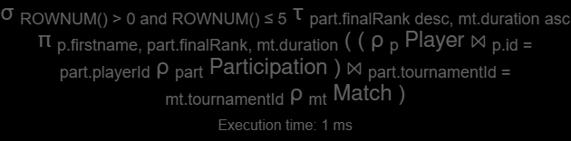

# Database Normalization Report

## 1. Introduction
Normalization is the process of refining a database's structure to ensure it is efficient, reliable, and professional. By applying rules known as **Normal Forms**, we transform disorganized data into a robust relational system.

### 1.1 Core Concept
> "Normalization establishes the appropriate logical format for data structures... its objective is to minimize storage space and ensure the integrity and reliability of information."
> — **Machado, Felipe Nery Rodrigues**

---

## 2. The Problem: Unnormalized Data (0NF)
Before normalization, data is often trapped in a **Flat File**—a single, massive table. This leads to **Database Anomalies** that compromise the system's health and CRUD operations.

| VendaID | ClienteID | NomeCliente | EndereçoCliente | LivroID | TítuloLivro | AutorLivro | ColaboradorID | NomeColaborador | DataVenda |
| :--- | :--- | :--- | :--- | :--- | :--- | :--- | :--- | :--- | :--- |
| 001 | 1001 | Ana Silva | Rua das Flores, 10 | 501 | O Alquimista | Paulo Coelho | 201 | João Pedro | 2024-06-01 |
| 002 | 1002 | Marco Antônio | Av. Brasil, 25 | 502 | A Bruxa de Portobello | Paulo Coelho | 202 | Maria Clara | 2024-06-02 |

### 2.1 Common Anomalies in 0NF
* **Redundancy:** Data (like Customer addresses) repeats across multiple rows.
* **Update Anomaly:** Changing a customer's address requires updating every single sale record.
* **Insertion Anomaly:** You cannot add a new book to the catalog unless it is sold.
* **Deletion Anomaly:** Deleting a sale might erase the only record of a specific book or customer.

---

## 3. Foundations of Normalization

### 3.1 Functional Dependencies
This defines "Who determines whom?".
* **Example:** `customer_id` functionally determines the `customer_name`.

### 3.2 The Normal Forms (The Checklist)
1.  **1st Normal Form (1NF):** Focuses on **Atomicity** (one value per cell).
2.  **2nd Normal Form (2NF):** Eliminates **Partial Dependencies** (specific to composite keys).
3.  **3rd Normal Form (3NF):** Eliminates **Transitive Dependencies** (the "gossip" between non-key columns).

---

## 4. First Normal Form (1NF): Atomicity
To achieve 1NF, every column must contain a single, indivisible value.

### 4.1 Case Study: Multivalued Attributes (Clients & Suppliers)
**Problem (0NF):** The `Emails` and `Telefones` columns contain multiple values separated by commas.

| ID | Nome | Emails | Telefones |
| :--- | :--- | :--- | :--- |
| 01 | Alpha Co | a@ex.com, b@ex.com | 123456, 987654 |

**Solution (1NF):** Decomposing multivalued attributes into specialized tables.
* **Table `entities`**: `id`, `name`, `type`.
* **Table `entity_emails`**: `email_id`, `email_address`, `entity_id` (FK).
* **Table `entity_phones`**: `phone_id`, `phone_number`, `entity_id` (FK).

---

## 5. Second Normal Form (2NF): Full Key Dependency
2NF is applied when a table has a **Composite Primary Key**. Every non-key attribute must depend on the **entire** key (Partial Functional Dependency avoidance).

### 5.1 Case Study: Bank Account Owners (FlexEmpresta)
In a Many-to-Many relationship between Customers and Accounts, we use an associative table. I refactored the model to comply with 2NF by removing partial dependencies:

* **Composite Key:** `id_customer` + `id_account`.
* **Action:** Removed `customer_name` (depends only on `id_customer`) and `account_type` (depends only on `id_account`).

### 5.2 Case Study: Courses and Materials
**Problem (1NF):** In a table with a composite key (`course_id` + `material_id`), the `professor_name` depends only on the `professor_id`.

**Solution (2NF):**
* **Table `professors`**: `professor_id`, `professor_name`.
* **Table `courses`**: `course_id`, `course_name`, `professor_id` (FK).
* **Table `course_materials`**: `material_id`, `course_id` (FK), `material_description`.

---

## 6. Third Normal Form (3NF): No Transitive Dependencies
3NF is achieved when a table is in 2NF and non-key attributes depend **only** on the primary key.

> "Every non-key attribute must provide a fact about **the key, the whole key, and nothing but the key**, so help me Codd." — **William Kent**

### 6.1 Case Study: Insurance Policies
**Problem (2NF):** In the table below, `ClientName` depends on `ClientID`, which is not the primary key of the policy. This is a **Transitive Dependency**.

| PolicyID (PK) | ClientID | ClientName | AgentID | AgentName | AgentOffice |
| :--- | :--- | :--- | :--- | :--- | :--- |
| P001 | 001 | Ana Silva | A01 | Carlos Dias | São Paulo |

**Solution (3NF):**
1.  **Table `clients`**: `ClientID`, `Name`, `Address`.
2.  **Table `agents`**: `AgentID`, `Name`, `Office`.
3.  **Table `policies`**: `PolicyID`, `Type`, `ClientID` (FK), `AgentID` (FK).

---

## 7. Boyce-Codd Normal Form (BCNF / FNBC)

BCNF is often considered a "stronger version" of the 3rd Normal Form (3NF). It addresses specific anomalies that 3NF might miss, particularly when a table has overlapping composite candidate keys.

### 7.1 The Golden Rule of BCNF
> "Every determinant must be a candidate key."

In plain English: If Column `A` determines the value of Column `B`, then `A` **must** be a Primary Key or a Candidate Key for that table. If `A` has "authority" over another column but isn't a key, the table needs to be decomposed to ensure data integrity.

---

### 7.2 Case Study: Academic Schema Normalization

**The Challenge:** Normalize the following flat structure (0NF):
`ProfessorID | ProfessorName | DepartmentID | DepartmentName | DeptHeadID | CourseID | CourseName`

#### The Solution (Optimized Schema):

To reach BCNF and eliminate all potential anomalies, the data was split into three specialized tables:

**1. Professors Table**
* `ProfessorID` (PK)
* `ProfessorName`
> **Reasoning:** Isolates teacher data. If a professor changes their name, we update it in exactly one row.

**2. Departments Table**
* `DepartmentID` (PK)
* `DepartmentName`
* `DeptHeadID` (FK referencing PROFESSORS)
> **Reasoning:** Removes Transitive Dependencies. The Department Name depends on the Department ID, not on the professor listed in a specific course row.

**3. Courses Table (The "Bridge" & Relationship Table)**
* `CourseID` (PK)
* `CourseName`
* `ProfessorID` (FK)
* `DepartmentID` (FK)
> **Strategy:** By including `DepartmentID` here, we ensure the Course is anchored to an academic unit. Even if the assigned Professor changes, the Course-Department relationship remains intact, preventing **Deletion Anomalies**.

---

### 7.3 Why this satisfies BCNF?

In the original 0NF/Legacy format, `DepartmentName` was being determined by `ProfessorID` in some rows, but `ProfessorID` was not the Primary Key of that unorganized table. 

---

## 8. Fourth Normal Form (4NF): Handling Multivalued Dependencies

4NF is the stage where we eliminate **Multivalued Dependencies (MVD)**. This happens when a single entity (e.g., a Collaborator) is associated with two or more independent lists of data (e.g., Projects and Dependents) within the same table.

### 8.1 The "Fake ID" Trap
In our study case, the original table used a row ID (001, 002...). This is a **Surrogate Key** that often masks massive redundancy.

* **The Problem:** Even with a unique ID per row, the combination of "João Silva" + "Project A" is repeated just to accommodate different dependents.
* **The Solution:** Discard the original row ID and decompose the independent facts into separate, specialized tables.

---

### 8.2 Case Study: Full Normalization (Up to 4NF)

This study demonstrates how to transform a redundant table into a robust relational model.

#### I. The Input: Denormalized Data (0NF)
The table below suffers from a **Cartesian Product** effect: every project is multiplied by every dependent for the same collaborator.

| ID | ColabID | Nome | Projeto | Dependente |
| :--- | :--- | :--- | :--- | :--- |
| 001 | C001 | João Silva | ProjetoA | Ana Silva |
| 002 | C001 | João Silva | ProjetoA | Maria Silva |
| 003 | C001 | João Silva | ProjetoB | Ana Silva |
| 004 | C001 | João Silva | ProjetoB | Maria Silva |
| 005 | C002 | Maria Oliveira | ProjetoB | Carlos Oliveira |
| 006 | C003 | Pedro Sousa | ProjetoC | Tereza Sousa |

---

#### II. The Normalized Solution (4NF Structure)

To fix the MVD, we isolate the two independent relationships (Collaborator-Project and Collaborator-Dependent).

**1. Table: Collaborators (Entity)**
| CollaboratorID (PK) | Name |
| :--- | :--- |
| C001 | João Silva |
| C002 | Maria Oliveira |
| C003 | Pedro Sousa |

**2. Table: Projects (Entity)**
| ProjectID (PK) | ProjectName |
| :--- | :--- |
| P01 | ProjetoA |
| P02 | ProjetoB |
| P03 | ProjetoC |

**3. Table: Colab_Proj (Relationship - 4NF)**
*Handles the Many-to-Many link between staff and projects.*
| ProjectID (PK, FK) | CollaboratorID (PK, FK) |
| :--- | :--- |
| P01 | C001 |
| P02 | C001 |
| P02 | C002 |
| P03 | C003 |

**4. Table: Dependents (Relationship - 4NF)**
*Handles the One-to-Many link between staff and their family.*
| DependentID (PK) | CollaboratorID (FK) | DependentName |
| :--- | :--- | :--- |
| D01 | C001 | Ana Silva |
| D02 | C001 | Maria Silva |
| D03 | C002 | Carlos Oliveira |
| D04 | C003 | Tereza Sousa |

---

### 8.3 Technical Justification

1.  **Elimination of MVD:** In the 0NF table, if João Silva had 3 projects and 3 dependents, we would need **9 rows** (3x3). In this 4NF version, he only occupies **3 rows** in `Colab_Proj` and **2 rows** in `Dependents`.
2.  **Removal of the "Fake ID":** The original row ID (001-006) was discarded because it forced a physical tie between independent facts.
3.  **Referential Integrity:** Using `CollaboratorID` as a Foreign Key (FK) ensures

---

## 9. Fifth Normal Form (5NF) - Join Dependency

**Simplified Goal:** To handle complex relationships involving three or more entities that are all interconnected.

**The Rule:** A table is in 5NF when it can be decomposed into smaller tables that, when joined back together, recreate the original data perfectly, without redundancy.

**Example (The Triangle Rule):**
Instead of one big table for `Salesperson`, `Product`, and `Region`, we create three:
1. Salesperson + Product
2. Salesperson + Region
3. Product + Region

**Why?** This prevents us from assigning a salesperson to sell a product in a region where that product isn't even available. It's about protecting the "business logic" across multiple connections.

---

## 10. Relational Algebra: The Foundation of SQL

> **Reference:** Based on the article "Álgebra Relacional: consulta de dados relacionais" by Ana Duarte (Alura, 05/06/2024) and exploratory practices using the RelaX simulator.

### 10.1. Why Study the Theory?
* **Foundation:** SQL is the practical implementation, but Relational Algebra (proposed by E.F. Codd in 1970) is the mathematical logic behind it.
* **Innovation Capacity:** Understanding the basics allows you to create custom solutions where automated tools might fail.
* **Optimization:** Grasping the "Query Tree" helps visualize how the DBMS processes data, enabling you to write more performant queries.

### 10.2. Technical Glossary
To master database literature, it is essential to translate everyday concepts into academic rigor:
* **Relation** = Table
* **Tuple** = Row (Record)
* **Attribute** = Column

### 10.3. Fundamental Operations

#### A. Selection ($\sigma$)
* **Goal:** Filter **rows** (tuples) based on a specific condition.
* **Example (Buscante E-commerce):** Books priced between 30 and 50.
    * $\sigma_{price \geq 30 \land price \leq 50} (Books)$

#### B. Projection ($\pi$)
* **Goal:** Select specific **columns** (attributes) from a relation.
* **Usage:** Cleaning the output to display only necessary fields (e.g., title and price).

#### C. Natural Join ($\Join$)
* **Goal:** Combine two tables based on a common attribute.
* **Practical Insight:** In an **Inner Join**, records without a match in the opposing table are discarded (e.g., the drop from 100 to 89 records when IDs don't match).

#### D. Cartesian Product ($\times$)
* **Goal:** Combine every row from one table with every row from another.
* **Usage:** Generating all possible combinations (e.g., matching every customer with every book in the catalog).

### 10.4. Data Behavior (Practical Insights)

#### The "Lost Record" Phenomenon
When performing a simple `JOIN`, the data volume might decrease unexpectedly.
* **Cause:** Records in "Table A" that do not have a corresponding Foreign Key in "Table B" (orphaned data).

#### LEFT JOIN Expansion and the NULL Value
* **Preservation:** The Left Join ensures that no data from the left-side table is lost.
* **The Void (NULL):** When a record is preserved but finds no match, the system fills the right-side attributes with `NULL`.
* **Utility:** Essential for identifying "gaps" (e.g., identifying customers who have never made a purchase).

### 10.5. Comparative Table: SQL vs. Relational Algebra

| SQL | Relational Algebra |
| :--- | :--- |
| `SELECT` | Projection ($\pi$) |
| `WHERE` | Selection ($\sigma$) |
| `JOIN` | Join ($\Join$) |
| `UNION` | Union ($\cup$) |
| `EXCEPT` | Difference ($-$) |
| `CROSS JOIN` | Cartesian Product ($\times$) |

### 10.6. Supporting Tools
* **[RelaX](https://dbis-uibk.github.io/relax/landing):** An indispensable online simulator developed by the **University of Innsbruck** for testing relational algebra logic and graphically visualizing the query execution tree. It is a powerful tool to bridge the gap between formal theory and practical SQL.

#### **Practical Analysis in RelaX:**
To demonstrate the concepts, I used the simulator to analyze the behavior of a query involving multiple tables:

**Figure 1: The SQL Input** 
  
*The original SQL query designed to retrieve data from the e-commerce database.*

**Figure 2: Formal Relational Algebra Translation** 

  
*The SQL command translated into formal algebraic symbols ($\sigma, \pi, \Join$), showing the mathematical logic of the operation.*

**Figure 3: Execution Tree and NULL Value Identification**   
*The execution tree visualizes the data flow. Here, we can observe the "Lost Record" phenomenon (row count changes) and the appearance of NULL values when records from the left table find no match.*

---

*"He who loves practice without theory is like the sailor who boards ship without a rudder and compass and never knows where he may cast anchor."* — **Leonardo da Vinci**