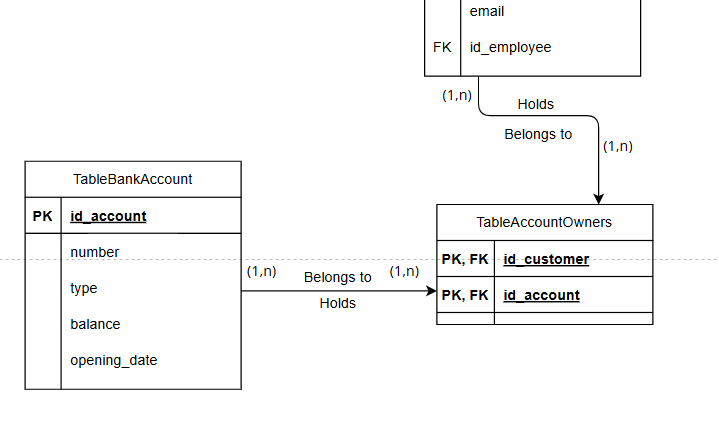

# Database Normalization Report

## 1. Introduction
Normalization is the process of refining a database's structure to ensure it is efficient, reliable, and professional. By applying rules known as **Normal Forms**, we transform disorganized data into a robust relational system.

### 1.1 Core Concept
> "Normalization establishes the appropriate logical format for data structures... its objective is to minimize storage space and ensure the integrity and reliability of information."
> — **Machado, Felipe Nery Rodrigues**

---

## 2. The Problem: Unnormalized Data (0NF)
Before normalization, data is often trapped in a **Flat File**—a single, massive table. This leads to **Database Anomalies** that compromise the system's health and CRUD operations.

| VendaID | ClienteID | NomeCliente | EndereçoCliente | LivroID | TítuloLivro | AutorLivro | ColaboradorID | NomeColaborador | DataVenda |
| :--- | :--- | :--- | :--- | :--- | :--- | :--- | :--- | :--- | :--- |
| 001 | 1001 | Ana Silva | Rua das Flores, 10 | 501 | O Alquimista | Paulo Coelho | 201 | João Pedro | 2024-06-01 |
| 002 | 1002 | Marco Antônio | Av. Brasil, 25 | 502 | A Bruxa de Portobello | Paulo Coelho | 202 | Maria Clara | 2024-06-02 |

### 2.1 Common Anomalies in 0NF
* **Redundancy:** Data (like Customer addresses) repeats across multiple rows.
* **Update Anomaly:** Changing a customer's address requires updating every single sale record.
* **Insertion Anomaly:** You cannot add a new book to the catalog unless it is sold.
* **Deletion Anomaly:** Deleting a sale might erase the only record of a specific book or customer.

---

## 3. Foundations of Normalization

### 3.1 Functional Dependencies
This defines "Who determines whom?".
* **Example:** `customer_id` functionally determines the `customer_name`.

### 3.2 The Normal Forms (The Checklist)
1.  **1st Normal Form (1NF):** Focuses on **Atomicity** (one value per cell).
2.  **2nd Normal Form (2NF):** Eliminates **Partial Dependencies** (specific to composite keys).
3.  **3rd Normal Form (3NF):** Eliminates **Transitive Dependencies** (the "gossip" between non-key columns).

---

## 4. First Normal Form (1NF): Atomicity
To achieve 1NF, every column must contain a single, indivisible value.

### 4.1 Case Study: Multivalued Attributes (Clients & Suppliers)
**Problem (0NF):** The `Emails` and `Telefones` columns contain multiple values separated by commas.

| ID | Nome | Emails | Telefones |
| :--- | :--- | :--- | :--- |
| 01 | Alpha Co | a@ex.com, b@ex.com | 123456, 987654 |

**Solution (1NF):** Decomposing multivalued attributes into specialized tables.
* **Table `entities`**: `id`, `name`, `type`.
* **Table `entity_emails`**: `email_id`, `email_address`, `entity_id` (FK).
* **Table `entity_phones`**: `phone_id`, `phone_number`, `entity_id` (FK).

---

## 5. Second Normal Form (2NF): Full Key Dependency
2NF is applied when a table has a **Composite Primary Key**. Every non-key attribute must depend on the **entire** key (Partial Functional Dependency avoidance).

### 5.1 Case Study: Bank Account Owners (FlexEmpresta)
In a Many-to-Many relationship between Customers and Accounts, we use an associative table. I refactored the model to comply with 2NF by removing partial dependencies:

* **Composite Key:** `id_customer` + `id_account`.
* **Action:** Removed `customer_name` (depends only on `id_customer`) and `account_type` (depends only on `id_account`).

### 5.2 Case Study: Courses and Materials
**Problem (1NF):** In a table with a composite key (`course_id` + `material_id`), the `professor_name` depends only on the `professor_id`.

**Solution (2NF):**
* **Table `professors`**: `professor_id`, `professor_name`.
* **Table `courses`**: `course_id`, `course_name`, `professor_id` (FK).
* **Table `course_materials`**: `material_id`, `course_id` (FK), `material_description`.

---

## 6. Third Normal Form (3NF): No Transitive Dependencies
3NF is achieved when a table is in 2NF and non-key attributes depend **only** on the primary key.

> "Every non-key attribute must provide a fact about **the key, the whole key, and nothing but the key**, so help me Codd." — **William Kent**

### 6.1 Case Study: Insurance Policies
**Problem (2NF):** In the table below, `ClientName` depends on `ClientID`, which is not the primary key of the policy. This is a **Transitive Dependency**.

| PolicyID (PK) | ClientID | ClientName | AgentID | AgentName | AgentOffice |
| :--- | :--- | :--- | :--- | :--- | :--- |
| P001 | 001 | Ana Silva | A01 | Carlos Dias | São Paulo |

**Solution (3NF):**
1.  **Table `clients`**: `ClientID`, `Name`, `Address`.
2.  **Table `agents`**: `AgentID`, `Name`, `Office`.
3.  **Table `policies`**: `PolicyID`, `Type`, `ClientID` (FK), `AgentID` (FK).