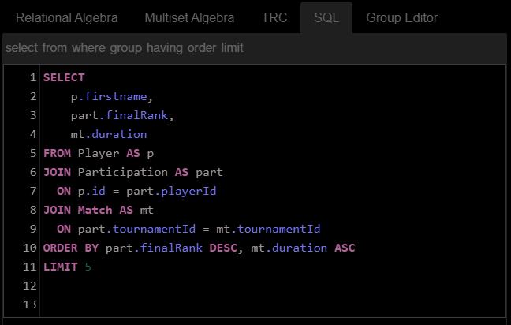
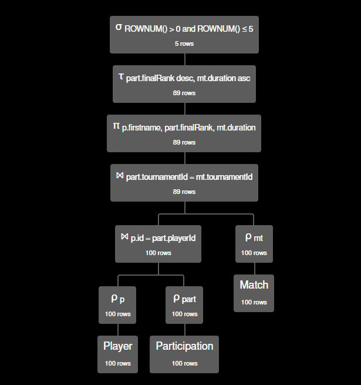

# Database Normalization & Modeling Report

## 1. Introduction
Normalization is the process of refining a database's structure to ensure it is efficient, reliable, and professional. By applying rules known as **Normal Forms (NF)**, we transform disorganized data into a robust relational system.

### 1.1 Core Concept
> "Normalization establishes the appropriate logical format for data structures... its objective is to minimize storage space and ensure the integrity and reliability of information."
> — **Machado, Felipe Nery Rodrigues**

---

## 2. The Problem: Unnormalized Data (0NF)
Before normalization, data is often trapped in a **Flat File**—a single, massive table. This leads to **Database Anomalies** that compromise CRUD (Create, Read, Update, Delete) operations.

| SaleID | CustomerID | CustomerName | Address | BookID | BookTitle | Author | StaffID | StaffName | Date |
| :--- | :--- | :--- | :--- | :--- | :--- | :--- | :--- | :--- | :--- |
| 001 | 1001 | Ana Silva | Street A, 10 | 501 | The Alchemist | Paulo Coelho | 201 | João Pedro | 2024-06-01 |
| 002 | 1002 | Marco Antônio | Ave B, 25 | 502 | The Witch of Portobello | Paulo Coelho | 202 | Maria Clara | 2024-06-02 |

### 2.1 Common Anomalies in 0NF
* **Redundancy:** Information (like addresses) repeats across multiple rows, wasting space.
* **Update Anomaly:** Changing a customer's address requires updating every single sale record.
* **Insertion Anomaly:** You cannot add a new book to the catalog until it is actually sold.
* **Deletion Anomaly:** Deleting a sale might accidentally erase the only record of a specific book or customer.

---

## 3. Foundations of Normalization

### 3.1 Functional Dependencies
This defines "Who determines whom?".
* **Direct Dependency:** $CustomerID \rightarrow CustomerName$.
* **The Goal:** Ensure every non-key attribute is a fact about the Primary Key.

### 3.2 The Normal Forms Checklist
1. **1st Normal Form (1NF):** Atomicity (no multi-valued cells).
2. **2nd Normal Form (2NF):** No Partial Dependencies (crucial for composite keys).
3. **3rd Normal Form (3NF):** No Transitive Dependencies (non-key columns shouldn't depend on other non-key columns).
4. **Boyce-Codd (BCNF):** A stronger version of 3NF where every determinant must be a candidate key.
5. **4th Normal Form (4NF):** Eliminates Multivalued Dependencies (MVD).

---

## 4. First Normal Form (1NF): Atomicity
Every column must contain a single, indivisible value. No lists or comma-separated values.

**Solution:** Decompose multivalued attributes into specialized tables.
* **Table `entities`**: `id`, `name`.
* **Table `entity_emails`**: `email_id`, `address`, `entity_id` (FK).

---

## 5. Second Normal Form (2NF): Full Key Dependency
2NF is mandatory when a table has a **Composite Primary Key**. Every non-key attribute must depend on the **entire** key.

### 5.1 Case Study: Bank Account Owners
In a Many-to-Many relationship (Customers and Accounts), we use an associative table.
* **Composite Key:** `id_customer` + `id_account`.
* **Action:** Moved `customer_name` to a separate `Customers` table because it only depended on part of the key (`id_customer`).

---

## 6. Third Normal Form (3NF): No Transitive Dependencies
3NF is achieved when a table is in 2NF and non-key attributes depend **only** on the primary key.

> "The data provides a fact about **the key, the whole key, and nothing but the key**, so help me Codd." — **William Kent**

### 6.1 Case Study: Insurance Policies
If `AgentName` depends on `AgentID`, and `AgentID` depends on `PolicyID`, we have a transitive chain.
**Solution:** Move Agent details to a dedicated `Agents` table.

---

## 7. Boyce-Codd Normal Form (BCNF)
BCNF handles anomalies where overlapping composite candidate keys exist.
**The Golden Rule:** "Every determinant must be a candidate key."

---

## 8. Fourth Normal Form (4NF): Handling Multivalued Dependencies
4NF eliminates **Multivalued Dependencies (MVD)**, which occur when one entity is linked to two independent lists (e.g., a Staff member having multiple Projects **and** multiple Dependents).

### 8.1 Case Study: The Cartesian Product Trap
In 0NF, if João has 3 projects and 3 dependents, you need $3 \times 3 = 9$ rows to show all combinations.
**The 4NF Fix:** Split into two independent tables: `Staff_Projects` and `Staff_Dependents`. This reduces the 9 rows to just $3 + 3 = 6$ rows.

---

## 9. Fifth Normal Form (5NF): Join Dependency
Handles complex "triangular" relationships. A table is in 5NF if it cannot be decomposed further without losing information when joined back. It ensures business logic is preserved across multi-entity connections.

---

## 10. Relational Algebra: The Foundation of SQL

Understanding the mathematical logic proposed by **E.F. Codd (1970)** is essential for query optimization.

### 10.1 Fundamental Operations
* **Selection ($\sigma$):** Filters **rows** (The `WHERE` clause).
* **Projection ($\pi$):** Filters **columns** (The `SELECT` clause).
* **Natural Join ($\Join$):** Merges tables based on common attributes.
* **Cartesian Product ($\times$):** Combines all rows from two tables.

### 10.2 Practical Analysis in RelaX
Using the **University of Innsbruck** simulator, we can visualize the **Execution Tree** to identify bottlenecks and `NULL` values.

**Figure 1: The SQL Input**  

**Figure 2: Execution Tree and NULL Identification**  
*Visualizing the flow helps identify "lost records" during Joins and understand data behavior.*

---

## 11. NoSQL & Power Query: Modern Data Challenges

### 11.1 NoSQL: Performance vs. Normalization
Unlike SQL's **ACID** (Consistency focused), NoSQL often follows **BASE** (Availability and Speed focused).

* **Strategic De-normalization:** We duplicate data (Nesting) to avoid `JOINs`, prioritizing **Read Speed**.
* **Polyglot Persistence:** Tech giants like **Amazon** and **Netflix** use NoSQL for high-speed feeds (DynamoDB/Cassandra) and Relational SQL for financial accuracy (PostgreSQL/Aurora).

### 11.2 Power Query: Normalizing for Analysis
In Business Intelligence (BI), we use **Power Query** to transform "Flat Tables" into a **Star Schema**:
1. **Fact Tables:** Quantitative data and events (Sales, Temperatures).
2. **Dimension Tables:** Descriptive attributes (Products, Dates, Customers).

**Why?** Normalizing into a Star Schema makes BI filters faster and prevents "Double Counting" errors in aggregations.

---
*"He who loves practice without theory is like the sailor who boards ship without a rudder and compass."* — **Leonardo da Vinci**