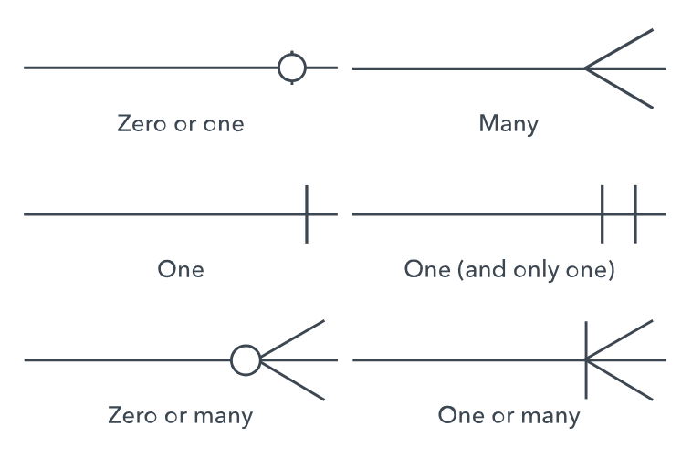

# Data Modeling Study Notes: From Theory to Physical Implementation

## 1. Target DBMS: MySQL
For this project, the chosen platform is **MySQL**, a leading relational database management system (RDBMS).

* **Open Source Solution:** Professional-grade features with high cost-efficiency (no licensing fees).
* **Performance and Reliability:** Robust environment for translating Relational Algebra into high-speed processing.

---

## 2. Modeling Dictionary (Nomenclature Transition)
Bridging the gap between theoretical design and physical implementation:

| Conceptual / Logical Model | **Physical Model (MySQL)** |
| :--- | :--- |
| Entity | **Table** |
| Attribute | **Column** |
| Tuple / Record | **Row** |
| Primary Key | **Primary Key (PK)** |
| Foreign Key | **Foreign Key (FK)** |
| Business Rule | **Constraints / Triggers** |

---

## 3. Data Types Mapping
Selecting the correct data type is critical for storage optimization and query performance.

### 3.1 Numeric Types
* **INTEGER:** (`TINYINT`, `SMALLINT`, `INT`, `BIGINT`). Choice depends on range (e.g., `TINYINT` for age).
* **DECIMAL / NUMERIC:** **Mandatory for financial data** to avoid rounding errors.
* **FLOAT / DOUBLE:** For scientific precision where slight imprecision is acceptable.

### 3.2 String Types (Text)
* **CHAR:** Fixed-length (e.g., State Codes like 'SP').
* **VARCHAR:** Variable-length. Standard for names, emails, and general text.
* **TEXT:** Large blocks of data (`TINYTEXT` to `LONGTEXT`).

### 3.3 Date and Time Types
* **DATE:** `YYYY-MM-DD`.
* **TIME:** `HH:MM:SS`.
* **DATETIME / TIMESTAMP:** Often used for "Created At" or "Updated At" tracking.

---

## 4. Keys vs. Indexes: The Pillar of Physical Modeling
Balancing **data integrity** (reliability) and **query performance** (speed).

### 4.1 Why the difference matters?
* **Integrity (Keys):** Prevents duplicate data and broken relationships.
* **Performance (Indexes):** Find a record among millions in milliseconds.
* **Cost:** Every index adds a small "cost" to write operations (`INSERT`, `UPDATE`).


### 4.2 Deep Dive into Key Types

| Key Type | Description | Example (Customer Table) |
| :--- | :--- | :--- |
| **Candidate Key** | Any unique column that could be the PK. | `id_customer`, `CPF`, `Email`. |
| **Primary Key (PK)** | Main identifier (chosen for performance). | `id_customer`. |
| **Alternative Key** | Candidate key NOT chosen as PK. | `CPF` (marked as `UNIQUE`). |
| **Foreign Key (FK)** | Link to a PK in another table. | `id_city` -> `Cities`. |
| **Composite Key** | Key made of two or more columns. | `(area_code + phone_number)`. |

### 4.3 Fundamental Differences
* **Keys:** Enforce rules and business logic.
* **Indexes:** Optimize retrieval speed (B-Tree structure).
* **Analyst's Takeaway:** Read-heavy systems (BI) need more indexes; Write-heavy systems (Logs) need fewer.

---

## 5. Integrity Constraints: Ensuring Data Quality

### 5.1 Entity Integrity (Primary Keys)
* **Rule:** Every table must have a PK; it **cannot be NULL**.

### 5.2 Referential Integrity (Foreign Keys)
* **Rule:** FK must point to a valid PK in another table.
* **Actions:** * `ON DELETE CASCADE`: Deletes children if parent is removed.
    * `ON DELETE RESTRICT`: Blocks deletion if children exist.

### 5.3 Domain Integrity (Data Validation)
* **NOT NULL:** Field is mandatory.
* **UNIQUE:** Prohibits duplicates (Alternative Keys).
* **CHECK:** Logical validation (e.g., `Price > 0`).
* **DEFAULT:** Auto-fills if no value is provided.


---

## 6. Practical Physical Implementation (SQL Script)

```sql
-- Parent Table
CREATE TABLE cities (
    id_city INT PRIMARY KEY AUTO_INCREMENT,
    city_name VARCHAR(100) NOT NULL,
    state_code CHAR(2) NOT NULL
);

-- Child Table
CREATE TABLE customers (
    id_customer INT AUTO_INCREMENT,
    cpf VARCHAR(11) NOT NULL,
    name VARCHAR(100) NOT NULL,
    email VARCHAR(100),
    age INT,
    registration_date TIMESTAMP DEFAULT CURRENT_TIMESTAMP,
    id_city INT,
    
    PRIMARY KEY (id_customer),
    UNIQUE (cpf),
    UNIQUE (email),
    
    -- Referential Integrity
    CONSTRAINT fk_customer_city 
        FOREIGN KEY (id_city) REFERENCES cities(id_city)
        ON DELETE RESTRICT,
        
    -- Domain Integrity
    CONSTRAINT check_age CHECK (age >= 18)
);

-- Performance Optimization
CREATE INDEX idx_customer_name ON customers (name);

---

## 7. Crow's Foot Notation Cheat Sheet

### 7.1 Reading the Symbols
1.  **Inner Symbol:** Represents the **Cardinality** (Max values: One or Many).
2.  **Outer Symbol:** Represents the **Modality** (Min values: Zero or One/Mandatory).




### 7.2 Practical Analysis of the Diagrams
Based on common modeling patterns:

* **The "One" Side (`||`):** Usually the **Parent Table**. This side contains the **Primary Key (PK)**.
* **The "Many" Side (`○<-`):** Usually the **Child Table**. This is where the **Foreign Key (FK)** lives.

### 7.3 Why this matters for Data Analysts
* **1:N Relationships:** In a `JOIN`, granularity remains at the "Many" level.
* **Optionality (Zero):** An `INNER JOIN` will hide records without relationships; use `LEFT JOIN` to see everything.

---

## 8. From Design to Implementation: The Engineering Workflow

### 8.1 The Implementation Pipeline
1.  **Schema Validation:** Final review of types and rules.
2.  **SQL Scripting (DDL):** Translating diagram to code.
3.  **Forward Engineering:** Executing scripts in the DBMS.
4.  **Integrity & Performance:** Applying FKs and Indexes.
5.  **Integration Testing:** Verifying constraints and load capacity.


### 8.2 Practical Tooling
> **Tip:** Several data modeling tools can automatically generate SQL scripts from a physical model, such as **Oracle SQL Developer**, **MySQL Workbench**, and **Microsoft SQL Server Management Studio**. While these tools greatly assist the process, maintaining a solid foundation in SQL is essential to validate, debug, and optimize the generated code.

### 8.3 Maintenance: The Synchronize Model Feature
Advanced tools offer **Synchronization**, which updates the live database schema via `ALTER` statements without deleting existing data, allowing the model to evolve safely.